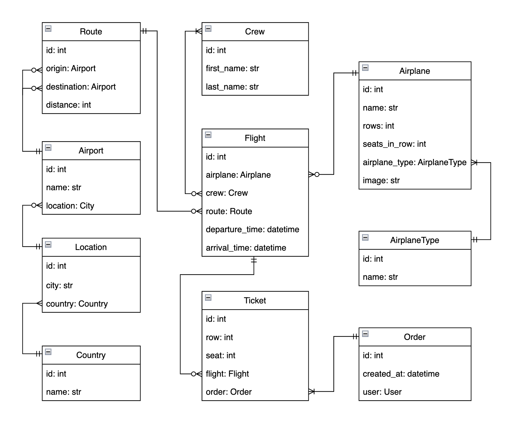

# Airport API Service

## API service for airport management built with DRF and Dockerized

Foooooooo and can be freely used.


## 🔌 &nbsp; GitHub Installation 

1. Install Python 3.12.

2. Clone the repository and set up the virtual environment:
    ```shell
    git clone https://github.com/mykyta-so/airport-api-service
    cd airport-api-service
    python3 -m venv venv
    source venv/bin/activate (on macOS)
    venv\Scripts\activate (on Windows)
    pip install -r requirements.txt
    ```
   
3. Set up environment variables:
   - Create a `.env` file.
   - Copy the content from `.env.sample` to `.env`.
   - Update the values in `.env` with your specific configuration.


4. Apply migrations:
    ```shell
    python manage.py makemigrations
    python manage.py migrate
    ```

5. Create a `superuser` account to access the Airport API Service:
   ```shell
   python manage.py createsuperuser
    ```
   Follow the prompts to set the username, email, and password.

<br>

## 🐳 &nbsp; Run with Docker

> **Important:**  Make sure [Docker](https://www.docker.com/) is installed and running.

1. Build and start the Docker containers:
    ```shell
    docker-compose build
    docker-compose up
    ```
2. Create a `superuser` account to access the Airport API Service:
   ```shell
    docker compose ps
    docker exec -it <your_image_name> sh
    docker-compose run app sh -c "python manage.py createsuperuser"
   ```
    Follow the prompts to set the username, email, and password.


3. Run tests:
    ```shell
    docker-compose run airport sh -c "python manage.py test"
   ```
<br>

## 🔑 &nbsp; Getting Access
### Available user endpoints:
- Register a new user: `/api/user/register/`
- Obtain refresh and access tokens: `/api/user/token/`
- View user information: `/api/user/me/`
>**Example:** `http://127.0.0.1:8000/api/user/register/`

After receiving the access token, you can use it to access the Airport API Service.<br>
You can utilize it in [Postman](https://www.postman.com/) or with the [ModHeader](https://chromewebstore.google.com/detail/modheader-modify-http-hea/idgpnmonknjnojddfkpgkljpfnnfcklj?hl=en) extension for Google Chrome.

**ModHeader Example:**<br>
Replace `<your token>` with your token.<br>


### Available Airport API Service endpoints:
- To see all available endpoints: `/api/airport/`


- Airplane Types: `/api/airports/airplane_types/`
- Airplane: `/api/airports/airplanes/`
- Upload airplane image: `/api/airports/airplanes/<airplane pk>/upload-image/`
- Crew: `/api/airports/crews/`
- Countries: `/api/airports/countries/`
- Locations: `/api/airports/locations/`
- Airports: `/api/airports/airports/`
- Routes: `/api/airports/routes/`
- Flights: `/api/airports/flights/`
- Orders: `/api/airports/orders/`

>**Example:** `http://127.0.0.1:8000/api/airports/orders/`

<br>

## 📑 &nbsp; API Documentation
- Swagger: `/api/schema/swagger-ui/`
- Redoc: `/api/schema/redoc/`
- Download the API schema: `/api/schema/`

>**Example:** `http://127.0.0.1:8000/api/schema/swagger-ui/`

<br>

## 👾 &nbsp; Features
- JWT Authentication.
- Custom permission `IsAdminAllORIsAuthenticatedReadOnly` for all endpoints except Orders.
- Login with `email` instead of `username`.
- Admin panel accessible at `/admin/`.
- API documentation with Swagger and Redoc.
- To prevent data loss, media files and the database are stored inside Docker volumes.
- Users can only view their own orders.
- Manage orders and tickets for all registered users.
- Create airplanes, locations, routes, flights and more for staff only.
- Airplanes include images.
- Filter airplane types by type.
- Filter flights by city of origin, city of destination, or both.
- Filter airports by city.
- Validation to prevent creating a flight with a departure time later than its arrival time.
- Validation to prevent creating a flight with the same origin and destination airports.
- Validation to prevent duplicate airplane types, airplanes, airports, and locations (combination of country and city).
- Validation to prevent creating tickets beyond the airplane’s seat capacity.
- Validation to prevent creating tickets that are already taken.
- Automatically create tickets when placing an order.

<br>

## 🔗 &nbsp; Database diagram

   
<br>

## 🖋️ &nbsp; Author
 Mykyta Soloviov <a href="https://github.com/mykyta-so">@mykyta-so</a>
